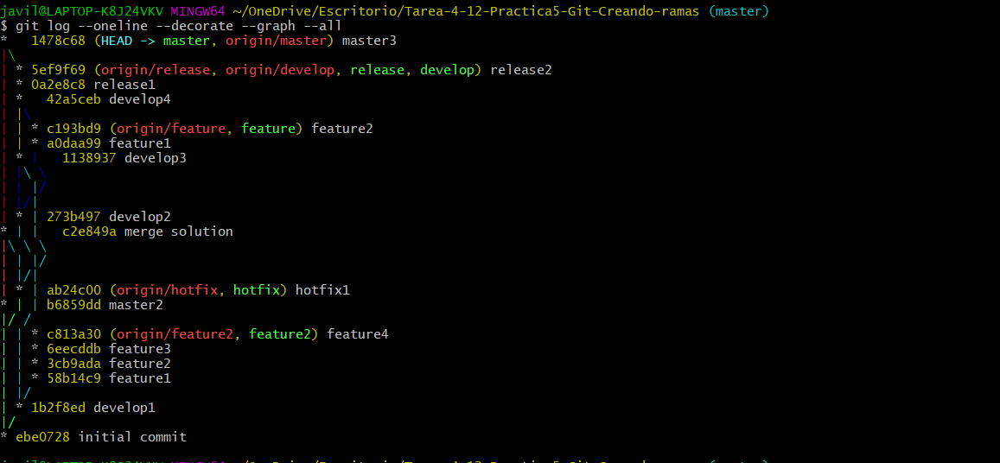
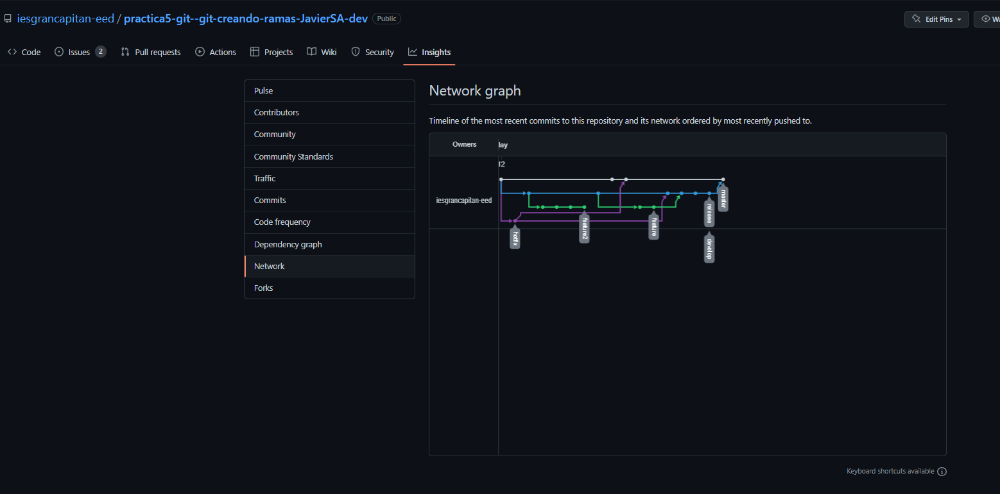

# Practica5. Git. Creando ramas

1. Adjunta un pantallazo del comando git log --oneline --decorate --graph --all
   

2. Una vez subido el repositorio CON TODAS SUS RAMAS, adjunta un pantallazo del apartado de GitHub "Insights"/"Network graph" 

